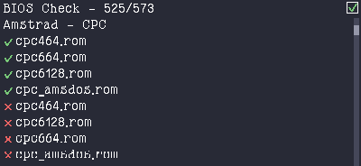

# Lutro BIOS Checker

[Lutro](https://github.com/libretro/libretro-lutro) app to scan your libretro/[RetroArch](https://retroarch.com/) system directory to find which BIOS files are present or missing.

It reads libretro's official BIOS/firmware database
([`System.dat`](resources/System.dat), in clrmamepro format) and checks each
listed file against the files actually in your RetroArch system directory. Currently does not check the MD5 for the files, as that can be slow. It just checks that the files are there.



## Usage

Run it with any libretro frontend that bundles the Lutro core (e.g. RetroArch):

```sh
retroarch -L lutro main.lua
retroarch -L lutro bioscheck.lutro
```

### Controls

| Action               | Keyboard            | Gamepad              |
| -------------------- | ------------------- | -------------------- |
| Scroll line          | Up / Down           | D-pad Up / Down      |
| Scroll page          | Page Up / Page Down |                      |
| Jump to top / bottom | Home / End          |                      |
| Jump category        | Left / Right        | D-pad Left / Right, L / R |
| Toggle present files | Enter / Space       | A / B                |

Mouse wheel scrolling and scrollbar dragging are also supported.

## Updating the database

`resources/System.dat` is libretro's
[System.dat](https://github.com/libretro/libretro-database/blob/master/dat/System.dat).
Replace it with a newer copy to track changes to the BIOS/firmware database.

## License

[MIT](LICENSE)